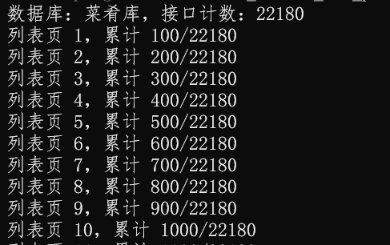
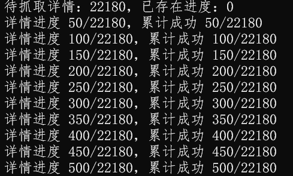
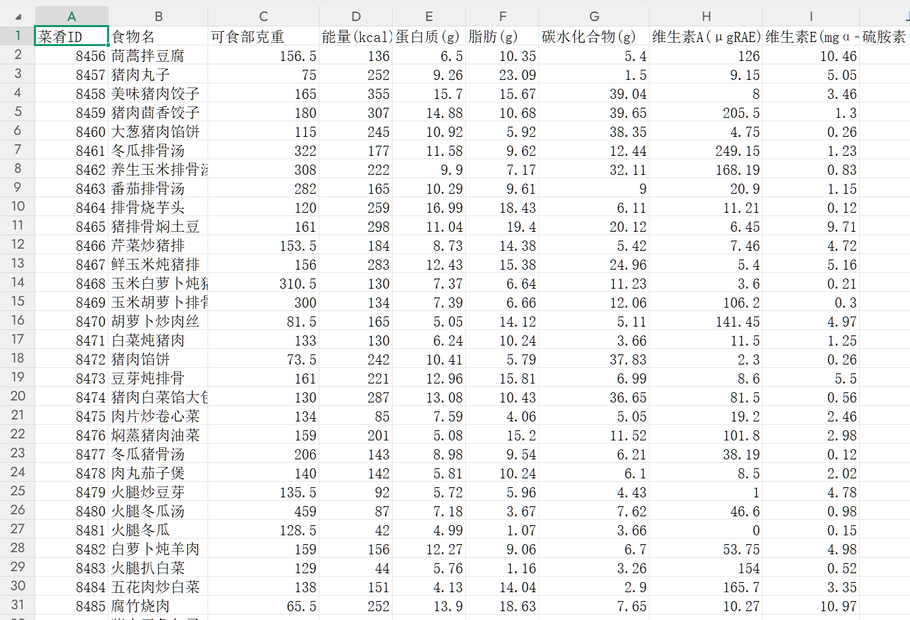

# NutriData 数据库 API 导出（爬取）工具

> 通过 NutriData 前端使用的加密 API 批量导出数据库数据（本项目以菜肴库为例），输出为 CSV，便于后续数据清洗和分析。

## 项目说明

本项目用于从 NutriData 菜肴库导出结构化营养数据。它不是 Selenium 页面元素爬虫，也不通过 XPath 批量解析网页 DOM，而是复用网站前端接口的 AES/RSA 加密请求方式，直接调用 `nutri-service` API 获取列表、详情和营养素字段。

默认导出字段包括：

- 菜肴ID
- 食物名
- 可食部克重
- 能量
- 蛋白质
- 脂肪
- 碳水化合物
- 维生素
- 矿物质

## 免责声明

本项目仅供学习、研究和个人数据处理实验使用，不得用于商业用途，不得用于批量分发、转售、镜像数据库或绕过平台授权限制。NutriData 数据及接口归其权利方所有。使用者应自行确认账号权限、使用条款、数据授权范围和当地法律法规要求。

由于批量获取第三方平台数据在合规性上存在风险，请控制请求频率，并仅在合法、合理、授权范围内使用。

## 截图

### 列表接口进度



### 详情接口进度



### CSV/表格预览



## 工作原理

NutriData 前端请求 API 时会：

1. 生成 16 位 AES key。
2. 用 RSA 公钥加密 AES key，放入请求头 `nutridata-random`。
3. 用 AES-ECB/PKCS7 加密请求参数。
4. 携带登录后的 `nutridata-token` 请求 `/api/nutri-service/...`。
5. 服务端返回 AES 加密结果，脚本再解密为 JSON。

脚本当前使用的核心接口：

- `/nutri-service/dblist/selectDbInfo`
- `/nutri-service/dish/selectFoodCount`
- `/nutri-service/dish/selectFoodList`
- `/nutri-service/dish/selectFoodById`

菜肴的 `可食部克重` 在json中不会返回最终值，故优先通过详情接口中的 `major[].note` 配料克重求和得到。例如 `50 + 100 + 5 + 0.5 + 1 = 156.5`。

## 环境要求

- Python 3.9+
- 可用的 NutriData 登录态 token
- Windows / macOS / Linux 均可

安装依赖：

```bash
pip install -r requirements.txt
```

## 获取 token

1. 浏览器打开 NutriData 并登录。
2. 按 `F12` 打开开发者工具。
3. 进入 `Network` / `网络`。
4. 访问菜肴库页面。
5. 点开任意 `nutri-service` 请求。
6. 在 `Request Headers` 中复制 `nutridata-token` 的值。

## 快速开始

先跑 20 条样本：

```powershell
$env:NUTRIDATA_TOKEN="你的nutridata-token"

python nutridata_export_dishes.py `
  --limit 20 `
  --page-size 20 `
  --workers 2 `
  --output sample_nutridata_dishes.csv `
  --progress sample_nutridata_dishes_progress.jsonl
```

全量导出：

```powershell
$env:NUTRIDATA_TOKEN="你的nutridata-token"

python nutridata_export_dishes.py `
  --page-size 100 `
  --workers 4 `
  --output nutridata_dishes_all.csv `
  --progress nutridata_dishes_all_progress.jsonl
```

## 参数说明

| 参数 | 默认值 | 说明 |
| --- | --- | --- |
| `--token` | 环境变量 `NUTRIDATA_TOKEN` | 已登录账号的 token |
| `--username` | 环境变量 `NUTRIDATA_USERNAME` | 用户名/手机号，可用于密码登录 |
| `--password` | 环境变量 `NUTRIDATA_PASSWORD` | 密码，可用于密码登录 |
| `--output` | `nutridata_dishes.csv` | 输出文件，支持 `.csv` 和 `.xlsx` |
| `--progress` | `nutridata_dishes_progress.jsonl` | 断点续跑进度文件 |
| `--page-size` | `10` | 列表接口每页数量；全量建议 `100` |
| `--workers` | `4` | 详情接口并发数；建议 `2-6` |
| `--limit` | `0` | 仅导出前 N 条；`0` 表示全量 |
| `--delay` | `0` | 每条详情请求后的延迟秒数 |

## 运行时间估计

以 22180 条菜肴为例：

- `workers=2`：约 2 到 3 小时
- `workers=4`：约 1.5 到 2.5 小时
- 网络慢、token 过期、服务端限流时会更久

如果失败较多，建议降低并发：

```powershell
python nutridata_export_dishes.py --workers 2 --delay 0.1 --output nutridata_dishes_all.csv
```

## 断点续跑

脚本会把每条详情结果写入 `--progress` 指定的 JSONL 文件。中途停止后，用同一个 progress 文件再次运行即可跳过已完成记录。

如果脚本字段逻辑发生变化，请使用新的 progress 文件，避免沿用旧缓存。

## 输出文件说明

CSV 使用 `utf-8-sig` 编码，Excel/WPS 直接打开通常不会乱码。营养素列名会带单位，例如：

- `能量(kcal)`
- `蛋白质(g)`
- `脂肪(g)`
- `碳水化合物(g)`
- `维生素A(μgRAE)`
- `钠(mg)`
- `钙(mg)`

## 仓库内容

```text
.
├── nutridata_export_dishes.py
├── requirements.txt
├── README.md
└── assets/
    └── screenshots/
```

## 不包含内容

本仓库不包含 NutriData 全量数据、账号、token、导出的 CSV、进度文件或错误文件。

